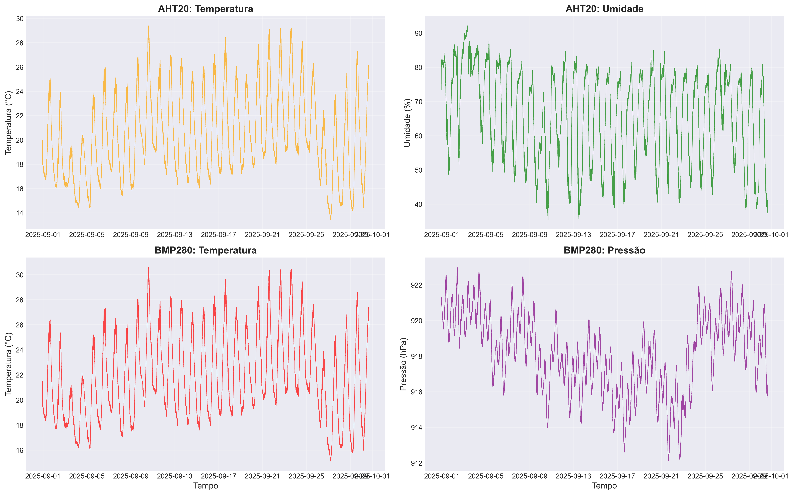
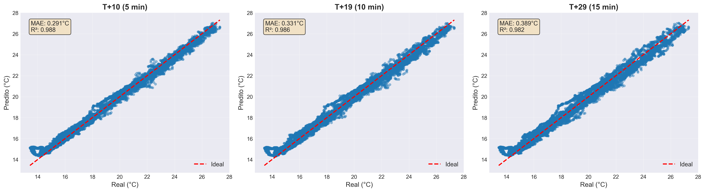
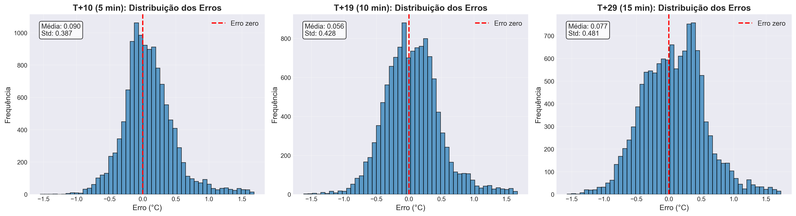
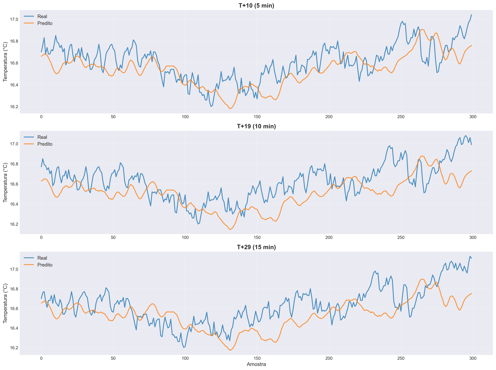
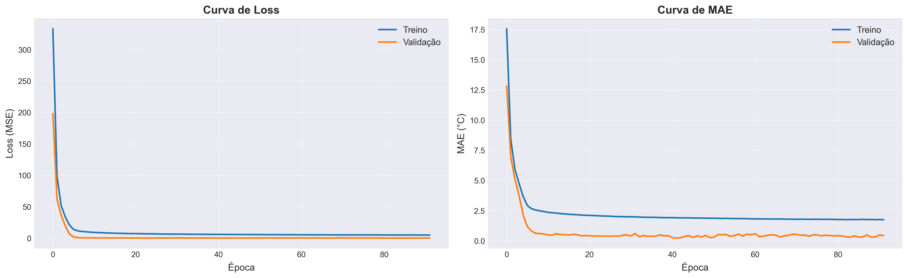

# Temperature Prediction - TinyML on RP2040

<p align="right">
  <a href="README.md"></a>
  <a href="README.en.md"></a>
</p>

<p align="left">
  
  
  
  
  
  
</p>

CNN 1D deployed on a Raspberry Pi Pico (RP2040) to predict temperature at +5, +10, and +15 minutes
ahead, using data from two I2C sensors - AHT20 and BMP280.

---

## How it works

The firmware collects sensor samples every 31 seconds, maintains a sliding window of
10 timesteps x 4 features (Temp_AHT20, Humid_AHT20, Temp_BMP280, Press_BMP280), normalizes the data
with Z-score parameters generated during training, and runs inference via TensorFlow Lite Micro.
Predictions are displayed on the serial monitor and on the SSD1306 OLED display.

```
Sensors (I2C0) -> Buffer [10x4] -> Z-score -> CNN 1D (TFLM) -> Predictions [+5, +10, +15 min]
```

---

## Repository structure

```
temperature_mlp/
|-- data/
|   |-- temp.csv
|-- firmware/
|   |-- main.c
|   |-- tflm_wrapper.cpp/.h
|   |-- scaler_params.h
|   |-- lib/
|       |-- aht20.c/.h
|       |-- bmp280.c/.h
|       |-- ssd1306.c/.h
|       |-- font.h
|-- images/
|   |-- Conv1D/
|   |-- MLP/
|   |-- LSTM/
|   |-- GRU/
|-- models/
|   |-- Conv1D/
|   |-- MLP/
|   |-- LSTM/
|   |-- GRU/
|-- notebooks/
    |-- temperature_prediction_CNN_1D_tinyml.ipynb
    |-- temperature_prediction_MLP_tinyml.ipynb
    |-- temperature_prediction_LSTM_tinyml.ipynb
    |-- temperature_prediction_GRU_tinyml.ipynb
```

---

## Dataset and features

Source: [Vitoria da Conquista Weather Data - September 2025](https://www.kaggle.com/datasets/jonassouza872/vitoria-da-conquista-weather-data-september) (Kaggle)

The original dataset contains 82,432 measurements collected over 30 days (Aug 31 - Sep 30, 2025) in the
Candeias neighborhood, Vitoria da Conquista - Bahia, Brazil, from 7 temperature sensors, 2 humidity
sensors, and 2 pressure sensors, sampled every 30 seconds via Raspberry Pi Pico. For this project,
the dataset was cleaned and reduced to keep only the AHT20 and BMP280 sensor columns - the same sensors
used in the embedded hardware - resulting in 4 temporal features used for training.

| Feature | Sensor | Description |
|---|---|---|
| Temp_AHT20 | AHT20 (I2C0 0x38) | Air temperature (C) |
| Humid_AHT20 | AHT20 (I2C0 0x38) | Relative humidity (%) |
| Temp_BMP280 | BMP280 (I2C0 0x76) | Barometric temperature (C) |
| Press_BMP280 | BMP280 (I2C0 0x76) | Atmospheric pressure (hPa) |

Time window: **10 samples** (~5 min of history) -> predictions at **+5, +10, and +15 min**.



---

## Architecture comparison

All architectures were trained on the same data, time window, and prediction horizons.

| Model | MAE | R2 | Parameters | TFLite | Deploy RP2040 |
|---|---|---|---|---|---|
| MLP | 0.3739 | 0.9834 | 1,891 | 6.86 KB | OK |
| **Conv1D** | **0.3370** | **0.9849** | **1,963** | **8.59 KB** | **OK** |
| LSTM | 0.3264 | 0.9881 | 3,235 | - | NO |
| GRU | 0.2230 (*) | 0.9931 (*) | 2,611 | - | NO |

> (*) Best overall metric, but **not supported by TFLite Micro** on RP2040.

### Why Conv1D?

LSTM and GRU generate `TensorListReserve` operations not implemented in TFLite Micro for Cortex-M0+,
making deployment impossible. Among deployable models:

- Conv1D reduces MAE by **9.9%** vs MLP (0.337 vs 0.374)
- Higher R2 across all prediction horizons
- Captures local temporal patterns via convolutional filters - advantage over MLP
- Only **72 more parameters** and **+1.73 KB** in TFLite
- Fits comfortably in flash and TFLM's 60 KB arena

---

## Conv1D Results

<table>
<tr>
  <td></td>
  <td></td>
</tr>
<tr>
  <td></td>
  <td></td>
</tr>
</table>

---

## Hardware in operation

<table>
<tr>
  <td></td>
  <td></td>
</tr>
<tr>
  <td colspan="2" align="center"></td>
</tr>
</table>

---

## Firmware - details

**Embedded model:** `temperature_model.h` generated by `xxd -i` from the `.tflite` file
**TFLM arena:** 60 KB (~29 KB used at runtime)
**Sample interval:** 31 s
**Normalization:** Z-score with `scaler_mean[]` and `scaler_scale[]` from `scaler_params.h`

**Pinout:**

| Pin | Function |
|---|---|
| GP0 (SDA) / GP1 (SCL) | I2C0 - AHT20 + BMP280 @ 100 kHz |
| GP14 (SDA) / GP15 (SCL) | I2C1 - SSD1306 OLED @ 400 kHz |
